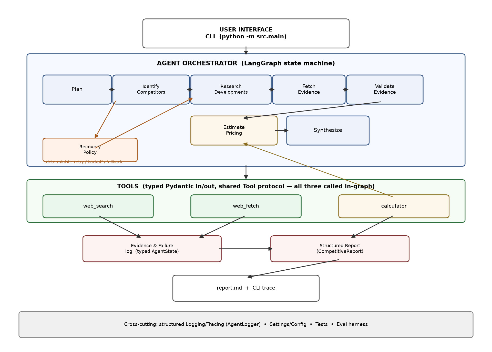

# MarketScout

**A competitive intelligence research agent, built as a controlled LangGraph
state machine rather than an unrestricted agent loop.**

Give it a goal like *"Analyze Stripe's competitive landscape in the
developer payments market"* and it plans, searches, fetches primary
sources, validates evidence, and produces a structured, cited Markdown
report — with deterministic recovery when a tool call fails.

```
$ python -m src.main --goal "Analyze Stripe's competitive landscape" --quiet --out report.md


PLAN
  1. Identify major competitors
  2. Find recent developments per competitor
  3. Fetch primary sources for evidence
  4. Validate extracted evidence
  5. Estimate illustrative pricing cost
  6. Generate the competitive brief

STEP 1 / 6 — Identify major competitors
  → web_search('Stripe competitors')
  ✓ 3 results returned
...
STEP 5 / 6 — Estimate illustrative pricing cost
  → calculator('100000 * 2.9 / 100')
  ✓ $2,900.00 on $100,000 illustrative volume
...
✓ Complete
```

## 1. What is MarketScout?

MarketScout is a scoped agentic system: one domain (competitive
intelligence), three tools, one typed state machine, deterministic
recovery, and a small evaluation harness — built deliberately narrow
rather than as a general-purpose autonomous agent. See
[`docs/design.md`](docs/design.md) for the full design rationale and
trade-offs.

It runs **with zero external API keys** — `web_search`/`web_fetch` fall
back to offline fixture data (real public info about Stripe, Adyen,
Paddle, and Braintree) and planning/synthesis fall back to deterministic
templates when no `GROQ_API_KEY`/`TAVILY_API_KEY` is set. Add keys
for live web search and LLM-authored prose; the architecture is identical
either way.

## 2. Demo

Three recorded transcripts are in [`examples/`](examples/):

- [`examples/normal_run.md`](examples/normal_run.md) — a clean end-to-end run.
- [`examples/failure_recovery.md`](examples/failure_recovery.md) — an
  induced schema failure, detected, retried, and recovered mid-run.
- [`examples/ambiguous_goal.md`](examples/ambiguous_goal.md) — a goal with
  no named company, handled via fallback rather than crashing.

## 3. Architecture



Four layers: a CLI, a LangGraph orchestrator holding the typed
`AgentState`, three typed tools, and a cross-cutting logging/config/test
layer. Recovery is a first-class component (`RecoveryPolicy`), not a
generic `try/except`.

## 4. Agent Workflow

```
User Goal → Plan → Identify Competitors → Research Developments
          → Fetch Evidence → Validate Evidence → Estimate Pricing
          → Synthesize → Report
```

Planning is always shown *before* execution (see the PLAN block in the
demo above) — the CLI never exposes model chain-of-thought, only the
structured, typed plan.

## 5. Tools

| Tool | Input → Output | Purpose |
|---|---|---|
| `web_search` | `str` → `SearchResults` | Discover competitors, developments, pricing pages. Never treated as authoritative evidence on its own. |
| `web_fetch` | `str` (URL) → `WebDocument` | Fetch the actual page behind a search result — this is what evidence is built from. |
| `calculator` | `str` (expression) → `float` | Called by `node_estimate_pricing` when a fetched document mentions a percentage-based fee: computes an illustrative cost on a fixed representative transaction volume. The number is computed by this tool, never asked of the LLM — see [`docs/assumptions.md`](docs/assumptions.md) for why the volume/rates are illustrative, not verified pricing. A restricted AST evaluator, not `eval`. |

All three implement the same `Tool` protocol (`src/tools/base.py`) and are
all genuinely invoked in the graph — none is wired in just to hit a tool
count.

## 6. Failure Recovery

`RecoveryPolicy` (`src/agent/recovery.py`) is a deterministic table, not an
LLM decision:

| Error type | Action |
|---|---|
| `SCHEMA_ERROR` | Retry once |
| `RATE_LIMIT` | Retry with exponential backoff |
| `TIMEOUT` | Retry with exponential backoff |
| `NOT_FOUND` | Fall back to an alternate query immediately |
| exhausted retries | Fall back to an alternate query, then give up |

Demonstrate it yourself:

```bash
python -m src.main --goal "Analyze Stripe's competitors" \
  --inject-failure malformed_search_response
```

This deliberately corrupts one search response's schema (field names
drift: `results`/`title`/`url` → `items`/`headline`/`link`) — a realistic
provider-contract break, not a random exception. Pydantic validation
rejects it, the recovery policy retries, and the run completes normally.
Other injectable modes: `fetch_timeout`, `rate_limit`.

## 7. Setup

Requires Python 3.11+.

```bash
python -m venv .venv
source .venv/bin/activate        # .venv\Scripts\activate on Windows
pip install -e ".[dev]"
cp .env.example .env             # optional — fill in keys for live mode
```

## 8. Running

```bash
python -m src.main --goal "Analyze Stripe's competitive landscape"
python -m src.main --goal "..." --inject-failure malformed_search_response
python -m src.main --goal "..." --out report.md
python -m src.main --goal "..." --quiet   # suppress the step trace, print only the report
```

## 9. Example Output

See [`examples/normal_run.md`](examples/normal_run.md) for a full
transcript, or run it yourself with the command above — offline mode
produces a real, grounded report with no setup required.

## 10. Testing

```bash
pytest -q
```

32 tests across three layers:

- **Unit** (`tests/unit/`): models reject malformed data, the planner's
  heuristic and LLM paths, each tool's success/failure behavior including
  injected failures, and every branch of `RecoveryPolicy`.
- **Integration** (`tests/integration/`): the full graph end-to-end,
  always against mocked/offline data — including a dedicated test that
  asserts the malformed-search-response failure is recorded, marked
  `recovered=True`, and the run still produces a valid final report, and
  a dedicated test that asserts the calculator is actually invoked and
  its output lands in the report's comparison table.

## 11. Evaluation

```bash
python -m evals.run_evals
python -m evals.run_evals --inject-failure malformed_search_response
```

Runs 6 scenarios from [`evals/datasets/scenarios.json`](evals/datasets/scenarios.json)
against the real graph and reports `planning_success`,
`tool_success_rate`, `recovery_success`, `citation_coverage`, and
`final_schema_valid` per scenario, plus an aggregate line. Not an
elaborate benchmark — a small, reproducible sanity check.

## 12. Limitations

- Offline fixtures are a fixed snapshot of a handful of companies, not
  live data.
- Evidence extraction without an LLM is a first-sentence heuristic.
- Competitor discovery is capped at 3 and has no deduplication against
  near-duplicate company names.
- The pricing-comparison step only produces an estimate for a competitor
  when a fetched source explicitly mentions a percentage-based fee; the
  transaction volume and any percentages used are illustrative demo
  figures, not verified real-world pricing (see
  [`docs/assumptions.md`](docs/assumptions.md)).
- No long-term memory or cross-run caching.

## 13. Future Work

- Persistent research cache.
- Source credibility scoring.
- Parallel competitor research (LangGraph fan-out).
- Human approval step before a report is finalized.
- Larger, adversarial evaluation benchmark.

## Repository layout

```
src/
  agent/      graph.py, state.py, planner.py, nodes.py, recovery.py, llm.py
  tools/      base.py, web_search.py, web_fetch.py, calculator.py, fixtures.py
  models/     plan.py, evidence.py, report.py
  config.py, logging.py, main.py
tests/        unit/, integration/
evals/        run_evals.py, metrics.py, datasets/scenarios.json
examples/     normal_run.md, failure_recovery.md, ambiguous_goal.md
docs/         architecture.png, design.md, writeup.md, assumptions.md
```
